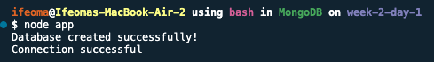
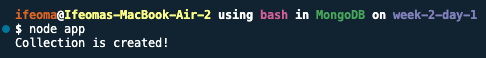
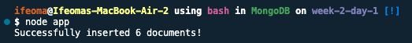
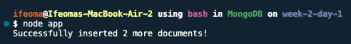
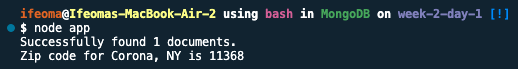
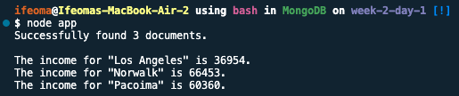
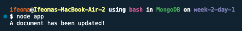
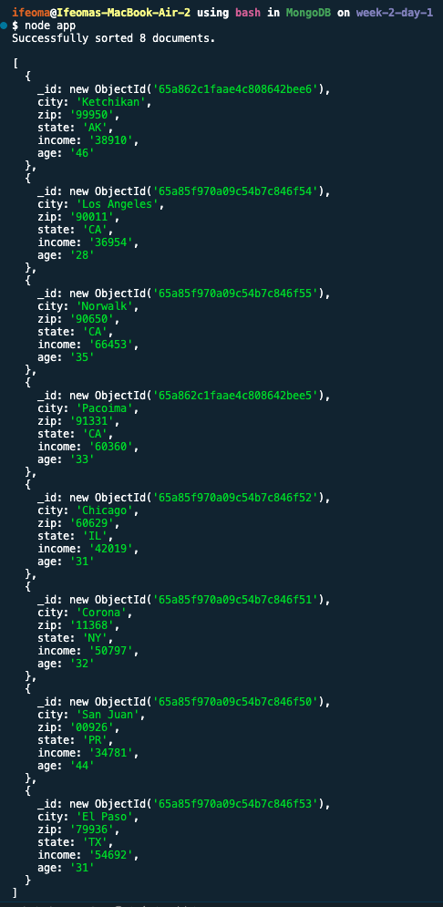

# Week 2 Day 1 Homework

**Table of Contents**

- [Setup](#setup)
- [Task 1 - Create a database](#task-1---create-a-database)
- [Task 2 - Create a collection](#task-2---create-a-collection)
- [Task 3 - Add data to collection](#task-3---add-data-to-collection)
- [Task 4 - Add records to the collection](#task-4---add-records-to-the-collection)
- [Task 5 - Search for specific data](#task-5---search-for-specific-data)
- [Task 6 - Filter data using the "query" object](#task-6---filter-data-using-the--query--object)
- [Task 7 - Update a document](#task-7---update-a-document)
- [Task 8 - Sort records by "State"](#task-8---sort-records-by--state-)
- [Extras](#extras)

Before we start working on each of the tasks, let's set up our DB environment.

Make sure you have _MongoDB_ installed on your computer.

## Setup

1. You can follow this link to make the installation. [Install here](https://zellwk.com/blog/install-mongodb)

2. Start up the MongoDB service using this command:

   ```bash
   brew services start mongodb-community

   # OR

   brew services run mongodb-community
   ```

3. Initialize the ExpressJS application using this command:

   ```bash
   npm init
   ```

   You can leave blank or accept default for all options. Your choice.

   After initializing the project, you should see a `package.json` file created.

4. Next, let's install a `mongodb` driver to our project. This will be added as a dependency so we can access `mongodb` with **NodeJS**.

   Use this command for the installation:

   ```bash
   npm install mongodb -save
   ```

   After installation, you should see a dependency entry in your `package.json` file.

   Now, **_NodeJS_** can now use this module to manipulate MongoDB databases.

## Task 1 - Create a database

Create a database called `statsdb`. Output a message on the terminal.

Follow these steps to perform the task:

### Steps:

- First, we would need a `MongoClient` to be able to create our database.

- Then, we create an instance of the client for our database

- After creating the DB, we have to test that we can connect to it.

Here's a copy of the code that does all that:

```js
const { MongoClient } = require("mongodb");

// Create an instance of MongoClient for mongodb
// "statsdb" is the database name
const client = new MongoClient("mongodb://127.0.0.1:27017/statsdb");

// Connect to the newly created database
client
  .connect()
  .then(() => {
    console.log("Database created successfully!");
    console.log("Connection successful");

    // Close the database connection when done
    client.close();
  })
  .catch((error) => console.log("Database failed to connect!", error));
```

To test that our configuration works, let's run our app using this command:

```bash
node app
```

Now you should see a message displayed on your terminal.



You can also check that the `statsdb` DB was created, but at this point, you won't be able to see the DB because it is empty.

You would only see the 3 default databases [`admin`, `config` and `local`] that are automatically created for you.

To launch your mongodb shell, you can either use the command, `mongo` or `mongosh` depending on your operating system. You should see a `>` sign on a new line, that indicates your shell is ready.

```bash
# lists all the database in the server
> show dbs
```

## Task 2 - Create a collection

Create a collection called `uscensus`. Output a message on the terminal.

Follow these steps to perform the task:

### Steps:

- For the rest of the task, I will add upon the first one. Don't forget to comment the previous task to avoid duplicate.

- Add this code block to your `app.js` file.

  ```js
  var dbo = client.db("statsdb");
  dbo.createCollection("uscensus").then(function () {
    console.log("Collection is created!");
    client.close();
  });
  ```

- To test that our configuration works, let's run our app using this command:

  ```bash
  node app
  ```

Now you should see a message displayed on your terminal.



- Now, let's check if the collection was created in the DB by running this command again:

  ```bash
  show dbs
  ```

  Now you should see `statsdb` displayed because it is no longer empty.

  We will go ahead and switch to the database so we can see our new collection, `uscensus` that is added. Do this by running these commands:

  ```bash
  use statsdb

  # display all collections
  show collections
  ```

## Task 3 - Add data to collection

Add the given data (the zip file) to the collection. Output a message on the terminal.

- The `.zip` file that was given is this:

  ```js
  var stats = [
    {
      city: "San Juan",
      zip: "00926",
      state: "PR",
      income: "34781",
      age: "44",
    },
    {
      city: "Corona",
      zip: "11368",
      state: "NY",
      income: "50797",
      age: "32",
    },
    {
      city: "Chicago",
      zip: "60629",
      state: "IL",
      income: "42019",
      age: "31",
    },
    {
      city: "El Paso",
      zip: "79936",
      state: "TX",
      income: "54692",
      age: "31",
    },
    {
      city: "Los Angeles",
      zip: "90011",
      state: "CA",
      income: "36954",
      age: "28",
    },
    {
      city: "Norwalk",
      zip: "90650",
      state: "CA",
      income: "66453",
      age: "35",
    },
  ];
  ```

Follow these steps to perform the task:

### Steps:

- In your `app.js` file, continue from where you stopped the second task. Don't forget to comment the previous task to avoid duplicate.

  ```js
  var stats = [
    {
      city: "San Juan",
      zip: "00926",
      state: "PR",
      income: "34781",
      age: "44",
    },
    {
      city: "Corona",
      zip: "11368",
      state: "NY",
      income: "50797",
      age: "32",
    },
    {
      city: "Chicago",
      zip: "60629",
      state: "IL",
      income: "42019",
      age: "31",
    },
    {
      city: "El Paso",
      zip: "79936",
      state: "TX",
      income: "54692",
      age: "31",
    },
    {
      city: "Los Angeles",
      zip: "90011",
      state: "CA",
      income: "36954",
      age: "28",
    },
    {
      city: "Norwalk",
      zip: "90650",
      state: "CA",
      income: "66453",
      age: "35",
    },
  ];
  var dbo = client.db("statsdb");
  dbo
    .collection("uscensus")
    .insertMany(stats)
    .then(function (res) {
      console.log(`Successfully inserted ${res.insertedCount} documents!`);
      client.close();
    });
  ```

- To test that our configuration works, let's run our app using this command:

  ```bash
  node app
  ```

Now you should see a message displayed on your terminal.



- Now, let's check if the documents were added into our collection:

  ```bash
  db.uscensus.find()
  ```

  This command displays all the documents added to the collection.

## Task 4 - Add records to the collection

Add the following records and output a message on the terminal.

City Zip State Income Age
Pacoima 91331 CA 60360 33
Ketchikan 99950 AK 00000 00

Follow these steps to perform the task:

### Steps:

- In your `app.js` file, continue from where you stopped the third task. Don't forget to comment the previous task to avoid duplicate.

  ```js
  var stats = [
    {
      city: "Pacoima",
      zip: "91331",
      state: "CA",
      income: "60360",
      age: "33",
    },
    {
      city: "Ketchikan",
      zip: "99950",
      state: "AK",
      income: "00000",
      age: "00",
    },
  ];
  var dbo = client.db("statsdb");
  dbo
    .collection("uscensus")
    .insertMany(stats)
    .then(function (res) {
      console.log(`Successfully inserted ${res.insertedCount} more documents!`);
      client.close();
    });
  ```

- To test that our configuration works, let's run our app using this command:

  ```bash
  node app
  ```

Now you should see a message displayed on your terminal.



- Now, let's check if the documents were added into our collection:

  ```bash
  db.uscensus.find()
  ```

  This command displays all the documents added to the collection, including the new ones that was just added.

## Task 5 - Search for specific data

Find out the zip code for Corona, NY. Output a message on the terminal.

Follow these steps to perform the task:

### Steps:

- In your `app.js` file, continue from where you stopped the fourth task. Don't forget to comment the previous task to avoid duplicate.

  ```js
  var dbo = client.db("statsdb");
  var query = { city: "Corona", state: "NY" };
  dbo
    .collection("uscensus")
    .find(query)
    .toArray()
    .then((items) => {
      if (items.length > 0) {
        console.log(`Successfully found ${items.length} documents.`);
        console.log(`Zip code for Corona, NY is ${items[0].zip}`);
      } else {
        console.log("No matching document found.");
      }
      client.close();
    })
    .catch((error) => console.log("Error fetching data:", error));
  ```

- To test that our configuration works, let's run our app using this command:

  ```bash
  node app
  ```

A message with the correct zipcode should be displayed on your terminal.



## Task 6 - Filter data using the "query" object

Find out the income for all cities in California. Example: `var myquery = { address: /^S/ };`, query all address that starts with **"S"**. Output a message on the terminal.

Follow these steps to perform the task:

### Steps:

- In your `app.js` file, continue from where you stopped the fifth task. Don't forget to comment the previous task to avoid duplicate.

  ```js
  var dbo = client.db("statsdb");
  var query = { state: "CA" };
  dbo
    .collection("uscensus")
    .find(query)
    .toArray()
    .then((items) => {
      if (items.length > 0) {
        console.log(`Successfully found ${items.length} documents.`);
        console.log();
        items.forEach((item) =>
          console.log(`The income for "${item.city}" is ${item.income}.`)
        );
        // items.forEach(item => console.log(item));
      } else {
        console.log("No matching document found.");
      }
      client.close();
    })
    .catch((error) => console.log("Error fetching data:", error));
  ```

- To test that our configuration works, let's run our app using this command:

  ```bash
  node app
  ```

A message with the correct city and income should be displayed on your terminal.



## Task 7 - Update a document

Update the income and age for Alaska: `38910` and `46` respectively. Output a message
on the terminal.

Follow these steps to perform the task:

### Steps:

- In your `app.js` file, continue from where you stopped the sixth task. Don't forget to comment the previous task to avoid duplicate.

  ```js
  var dbo = client.db("statsdb");
  var myquery = { state: "AK" };
  var newvalues = { $set: { income: "38910", age: "46" } };
  dbo
    .collection("uscensus")
    .updateOne(myquery, newvalues)
    .then(function () {
      console.log("A document has been updated!");
      client.close();
    });
  ```

- To test that our configuration works, let's run our app using this command:

  ```bash
  node app
  ```

Now you should see a message displayed on your terminal.



- Now, let's check if the documents were added into our collection:

  ```bash
  db.uscensus.find()
  ```

  This command displays all the documents added to the collection, including the one that was just updated.

## Task 8 - Sort records by "State"

Sort records in ascending order by state. **Note:** `1` (ascending) `-1` (descending). Output a message on the terminal and also the new sorted list.

Follow these steps to perform the task:

### Steps:

- In your `app.js` file, continue from where you stopped the seventh task. Don't forget to comment the previous task to avoid duplicate.

  ```js
  var dbo = client.db("statsdb");
  var mysort = { state: 1 };
  dbo
    .collection("uscensus")
    .find()
    .sort(mysort)
    .toArray()
    .then((items) => {
      console.log(`Successfully sorted ${items.length} documents.`);
      console.log();
      console.log(items);
      client.close();
    });
  ```

- To test that our configuration works, let's run our app using this command:

  ```bash
  node app
  ```

You should see the entire document sorted by alphabetical order displayed on your terminal.



## Extras

- [Markdown TOC](https://ecotrust-canada.github.io/markdown-toc/)
